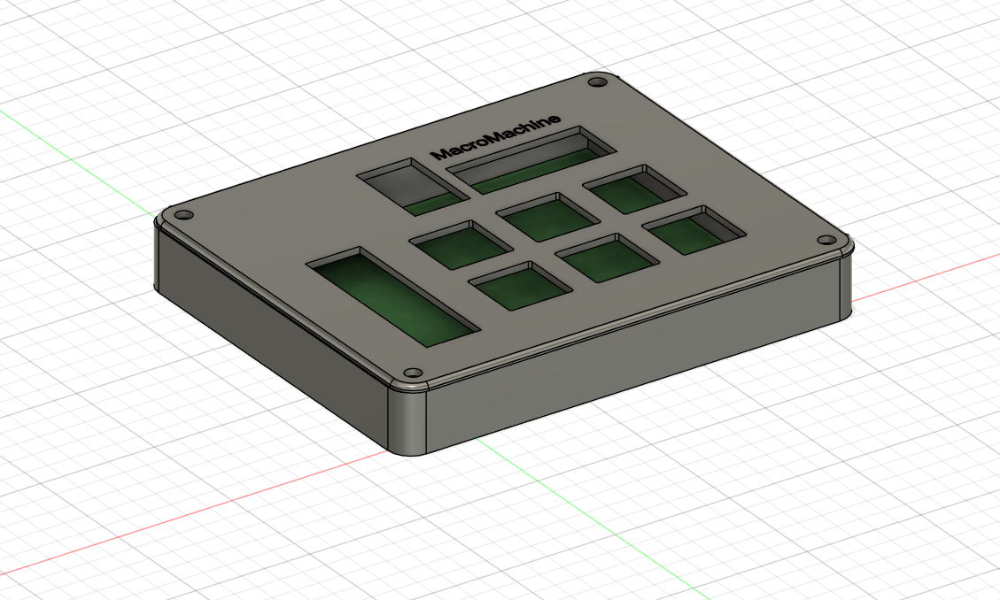

This is a MacroPad Desgined with help from HackClub Blueprints Hackpad. My Design uses 6 mx switches with 4 indicator leds and an info screen to quickly preform actions on my desktop and pull any interesing info on the the OLED Screen

This is my first time using KiCad to create custom PCBs as well as using Fusion360, I am using this as an opertunity to learn design software so I can eventualy start creating fully custom projects in the Future

!!Ignoure OPL_Kicad_Library, KiCad-SSD1309-... and MacroMachine-Kicad only look at MacroMachine dir as all realvent files are there

BOM:

6x Cherry MX Switches
4x SK6812 MINI Leds
1x XIAO RP2040
1x SSD1306 0.91 inch OLED Screen
6x Blank DSA Keycaps
4x M3x16 Bolt
4x M3 Heatset

Case:

PCB:

PCB Schem:

Full:
